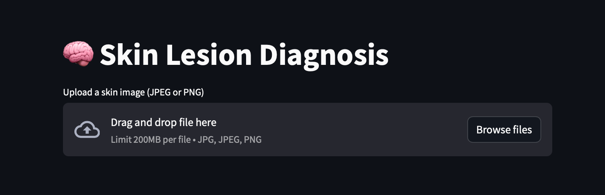
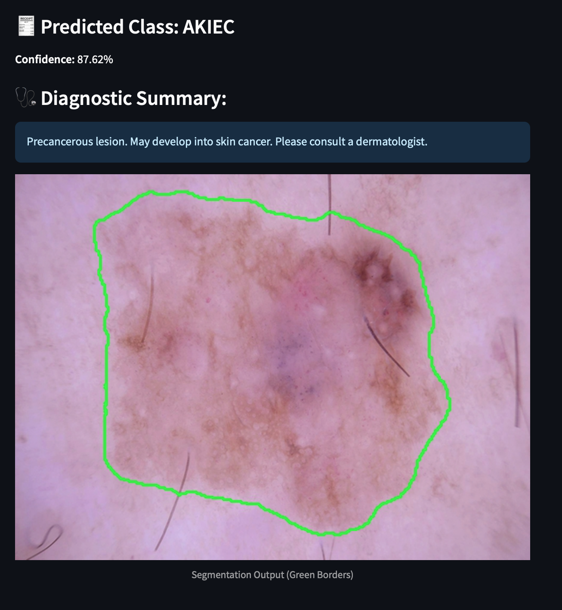

# SkinDx – Skin Cancer Detection Web App 🧬

**SkinDx** is a deep learning–powered web application built with Streamlit to assist in the early detection of skin cancer. It provides both **classification** and **segmentation** of uploaded skin lesion images — helping identify lesion types and highlight affected areas with precision.

---

## 🔍 Features

- 🎯 **Skin Lesion Classification**  
  Predicts the type of lesion using a trained CNN classifier.

- 🧠 **Lesion Segmentation**  
  Locates the exact region of concern on the skin using a UNet-based model.

- 💡 **User-Friendly Interface**  
  Drag-and-drop image classification directly in your browser via Streamlit.

---

## 🖼️ How It Works

1. Launch the app with:
   ```bash
   streamlit run Home.py
   ```

2. On the homepage, click **“Classify Image”**

3. Upload a photo of a skin lesion

4. The app will:
   - Classify the lesion type (e.g., melanoma, benign, etc.)
   - Display a segmentation mask highlighting the lesion area

---

## 🖼️ Screenshots

| Home Page | Upload Image |
|-----------|---------------|
|  |  |

| Results (Classification + Segmentation) |
|-----------------------------------------|
|  |

---

## 📦 Setup Instructions

### 1. Clone the repository

```bash
git clone https://github.com/Matiimov/Skin-Cancer-Detection-.git
cd Skin-Cancer-Detection-
```

### 2. Download model weights

Download `unet.weights.h5` from the link below and place it in the project root folder:

👉 [Download from Google Drive] (https://drive.google.com/file/d/1LMzNReIhf-i4vA9KyVNMaVz78zgPNk6T/view?usp=sharing)

---

## 🚀 Run the App

```bash
streamlit run Home.py
```

This will open the web app in your default browser.

---

## 📌 Notes

- This app is for **educational and research purposes only**. It is **not approved for medical diagnosis**.
- Results depend on the quality of input image and training data.

---

## 👨‍💻 Author

Developed by [@Matiimov](https://github.com/Matiimov)

---

## 📄 License

This project is open-source and licensed under the [MIT License](LICENSE).
